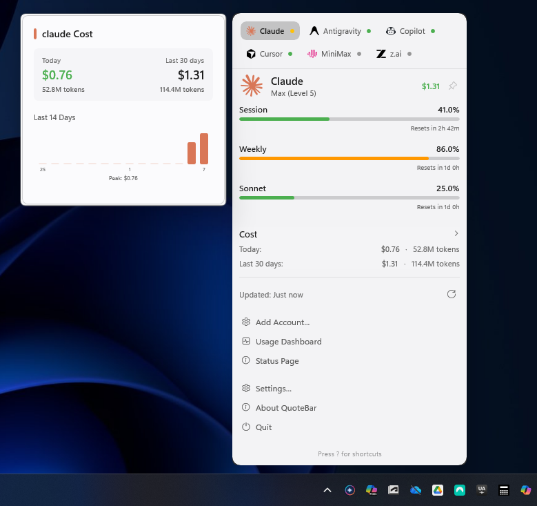
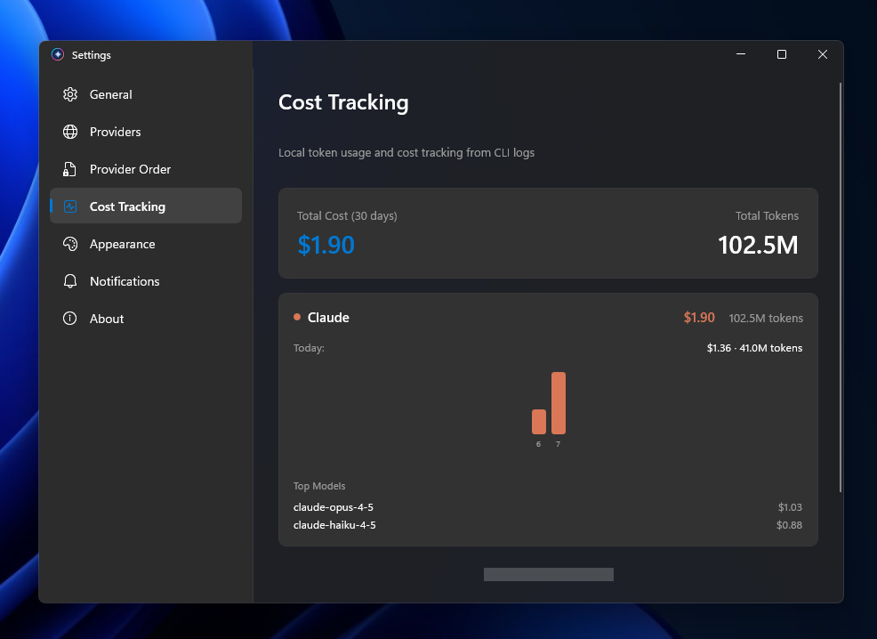
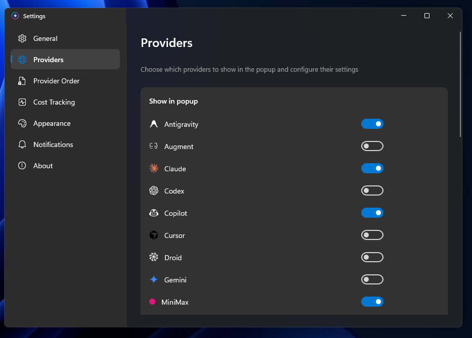

# QuoteBar 🎚️


Native Windows 11 application for monitoring AI provider usage. Track quotas, costs, and status across Claude, Codex, Cursor, Gemini, Copilot, Droid, z.ai, Antigravity, Augment, and MiniMax from the system tray.



## Overview

QuoteBar runs in your system tray and shows real-time usage metrics for your AI services. View daily/weekly quotas, track spending, and monitor service status—without interrupting your workflow.

## Features

- System tray integration with live usage indicators
- Multi-provider support (10+ AI services)
- Secure credential storage via Windows Credential Manager
- Auto-update with GitHub Releases
- Cost tracking with 30‑day history
- Provider ordering and dynamic settings
- Native Windows 11 design (Mica backdrop, WinUI 3)
- Dark/light theme (follows system)
- Service status monitoring (incident alerts)
- Manual and auto‑refresh modes
- Keyboard shortcuts for quick access

## Cost Tracking



View your spending across all providers with daily breakdowns and total costs. Historical data tracked automatically for Claude and Cursor.

## Provider Management



Enable/disable providers, configure authentication methods, and reorder them to match your workflow.

## Supported Providers

| Provider | Auth | Limits | Cost |
|----------|--------|---------|-------|
| [Claude](docs/claude.md) | OAuth/CLI | Session + Weekly | ✅ |
| [Codex](docs/codex.md) | OAuth | Usage + Billing | - |
| [Cursor](docs/cursor.md) | API | Billing cycle | ✅ |
| [Gemini](docs/gemini.md) | OAuth | Quota limits | - |
| [Copilot](docs/copilot.md) | OAuth | Plan usage | - |
| [Droid](docs/droid.md) | API | Billing cycle | - |
| [z.ai](docs/zai.md) | API Token | Quota limits | - |
| [Antigravity](docs/antigravity.md) | Local probe | Session + Weekly | - |
| [Augment](docs/augment.md) | Cookies | Session + Credits | - |
| [MiniMax](docs/minimax.md) | Cookies | Quota limits | - |

## Install

### Requirements

- Windows 10 (19041) or later
- Windows 11 recommended for best experience

### Quick Install

[](https://github.com/crhistian-cornejo/QuoteBar/releases/latest)

### Development Build

```powershell
cd QuoteBar
.\dev.ps1 run
```

## Development

### Build

```powershell
# Release build
.\dev.ps1 build

# Run in release mode
.\dev.ps1 run

# Watch mode (hot reload)
.\dev.ps1 watch

# Clean
.\dev.ps1 clean

# Publish for distribution
.\dev.ps1 publish
```

### Project Details

**Technology Stack**
- UI: WinUI 3 (Windows App SDK 1.6)
- Language: C# (.NET 9.0)
- Architecture: MVVM with CommunityToolkit.Mvvm
- XAML: Compiled XAML with hot reload

**Key Patterns**
- Provider registry with fallback strategies
- MVVM with observable properties
- Dependency injection via IServiceProvider
- Async/await throughout
- Settings persistence via JSON
- Secure credentials via Windows Credential Manager

### Adding a New Provider

1. Create provider folder in `Core/Providers/YourProvider/`
2. Implement `IProviderDescriptor` with fetch strategies
3. Register in `ProviderRegistry.RegisterDefaultProviders()`
4. Add settings in `ProvidersSettingsPage.cs`
5. Add icon in `Assets/icons/`

See `Core/Providers/ProviderSettings.cs` for the dynamic settings framework.

### Releasing

1. Bump version in `QuoteBar/QuoteBar.csproj`
2. Build: `.\dev.ps1 release`
3. Create GitHub release with tag
4. Upload `QuoteBar-*.zip` from `bin/Release/`
5. Auto‑updater will notify users

## Settings

QuoteBar stores configuration in:
```
%LocalAppData%\QuoteBar\settings.json
```

Usage history is stored separately:
```
%LocalAppData%\QuoteBar\usage_history.json
```

API tokens are stored in Windows Credential Manager (encrypted).

## Keyboard Shortcuts

| Shortcut | Action |
|----------|--------|
| `Win + Shift + Q` | Toggle popup |
| `1`‑`9` | Switch provider |
| `R` | Refresh data |
| `D` | Open dashboard |
| `S` | Open settings |
| `P` | Pin popup |
| `Esc` | Close popup |
| `?` | Show help |

## Privacy & Security

- API tokens stored in Windows Credential Manager (DPAPI encrypted)
- Browser cookies reused when enabled (no password storage)
- No data sent to external servers except provider APIs
- Local storage only (settings + usage history)
- Open source: [GitHub](https://github.com/crhistian-cornejo/QuoteBar)

## Documentation

- [Provider setup guides](docs/)
- [Architecture overview](docs/architecture.md)
- [Settings reference](docs/settings.md)
- [Release process](docs/releasing.md)

## Credits

Inspired by [CodexBar](https://github.com/steipete/CodexBar) for macOS.

---

## 📊 Repo Activity

[](https://github.com/crhistian-cornejo/QuoteBar)

## 📈 GitHub Stats


---

## License

MIT
